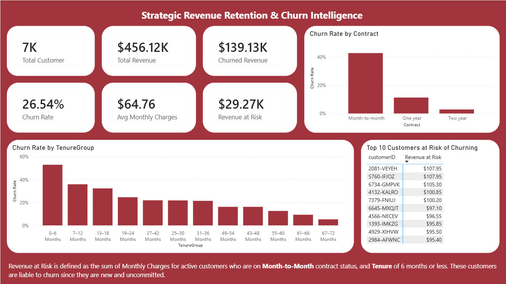
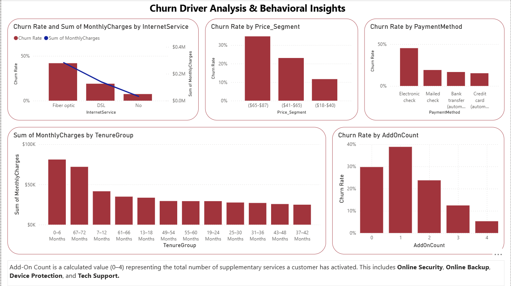

# Telco-Churn-Analysis
A Power BI project analyzing a 26.54% churn rate to identify $139K in monthly revenue loss. Features a Risk-Based Framework to quantify 'Revenue at Risk' and predict customer behaviour.

 

## Project Overview
This project focuses on identifying and mitigating revenue leakage within a telecommunications company. By analyzing customer behavior, contract structures, and service adoption, I developed an interactive Power BI dashboard that transforms raw churn data into an actionable retention strategy.

## Problem Statement
Customers are leaving. What's happening? The organization faced a 26.54% churn rate, resulting in a realized monthly loss of $139.13K. The primary challenge was not just identifying who left, but quantifying the financial exposure of current customers and identifying the behavioral triggers that precede a cancellation.

## Analytical Approach
I didn't just look at the total churn; I broke it down into six key areas to understand the "why" behind the numbers:

*   **Contract Type (Structural):** I looked at how much freedom a customer has. I compared people on month-to-month plans against those on long-term contracts to see who leaves the fastest.
*   **Tenure (The Newcomer Phase):** I analyzed the customer lifecycle to find the Danger Zone. I wanted to see if people leave more often during their first few months of service.
*   **Extra Services Depth:** I checked how many extra features (like Security or Tech Support) customers use. Usually, the more services a customer has, the harder it is for them to leave.
*   **Price Points (Financial):** I grouped customers by their monthly bill to find the point where the cost starts to feel too high for the value provided.
*   **Payment Methods (Transactional):** I examined how people pay their bills. I wanted to see if certain payment types, like electronic checks, are linked to higher churn rates.
*   **Internet Service (Product Type):** I compared our different internet technologies (like Fiber Optic vs. DSL) to see if a specific product was underperforming or causing frustration.

## Dataset and Structure
The analysis was performed on a Telco Customer Churn dataset comprising 7,043 records. Key data points included:
*   **Demographics:** Gender, Senior Citizen status, Dependents.
*   **Services:** Internet type, Security, Backup, Tech Support.
*   **Financials:** Monthly Charges, Total Charges, Payment Methods.
*   **Account Info:** Tenure, Contract type (Month-to-month, One year, Two year).

## Data Cleaning and Feature Engineering
*   **Feature Engineering:** I Created an `AddOnCount` column using DAX, aggregating four key services (Tech Support, Online Security, Online Backup, Device Protection) into a score of 0–4.
*   **Risk Modeling (DAX):** Developed a custom "Revenue at Risk" measure using a filtered calculation for active customers with high-freedom (month to month) contracts and low tenure (less than or equal to 6 months).
*   **Segmentation:** Created `Price_Segment` and `TenureGroup` bins with Power Query to identify specific Pain Thresholds.

## Key Insights from Dashboard

.

*   **The Danger Zone:** Churn rate is highest in the 0–6 month window (exceeding 50%). This indicates a critical need for improved onboarding.
*   **Revenue Paradox:** The organization makes most money from customers in their first 6 months (0–6 months) and the very long-term customers (67–72 months). But even though the new customers bring in a lot of cash, they are also the group most likely to quit.
*   **The Price Ceiling:** Customers billed between $65–$87 per month show the highest churn propensity. This could mean that at this price, they expect great service. If the internet is even a little slow, they can feel cheated and then leave.
*   **The Stickiness Effect:** Customers with 3+ add-ons have a significantly lower churn rate compared to customers with 0–1 add-ons.
*   **Structural Vulnerability:** Month-to-month contracts account for the vast majority of churned revenue, highlighting the risk of High Freedom account types. The customers in this category are likely to leave because they are not committed to the organization.
*   **Premium Product Risk:** Fiber Optic which is the "Premium" product brings in the most revenue, but it has a very high churn rate (over 40%). This could be because they do not get the value they paid for.

## Recommendations
*   **Early Intervention:** The Top 10 Customers at Risk list should be used to trigger an automated "Check-in" call or email from a dedicated customer success team before they have a chance to churn.
*   **Contract Conversion Incentives:** Targeted promotions to transition from month-to-month plans to discounted 1-year contracts.
*   **Service Bundling:** Automatically include Online Security or Tech Support for free for the first 3 months of every new Fiber Optic plan. This increases their "Add-On Count," making them less likely to leave once the trial ends.
*   **Tier Realignment:** Review the pricing of mid-tier plans. If customers in this bracket $65–$87 feel they aren't getting enough value, consider adding a "value-add" service to justify the cost without lowering the price.
*   **Onboarding Retention:** Implement a 90-day "Customer Success" program for new sign-ups to navigate the high-risk 0–6 month tenure window. Create a "Welcome Journey" that rewards customers for staying 3 months and 6 months. Small rewards at these specific milestones can push them through the high-risk "Danger Zone".
*   **Performance Monitoring:** Since Fiber Optic has a 40%+ churn rate, implement a technical health check for these customers during their first 90 days to ensure they are actually receiving the high speeds they pay for.
*   **Automatic Payment Promotions:** Encourage customers in this price bracket ($65-$87) to switch from Electronic Checks to automatic credit card payments by offering a small monthly discount. This removes the monthly "decision point" where they evaluate if the bill is worth it.

## Conclusion
The company is losing $139.13K monthly, primarily driven by high-paying "Newbies" in their first six months. The 26.54% churn rate is highest among Fiber Optic users on month-to-month plans, particularly those paying $65–$87. To stabilize revenue, we must bridge this "Danger Zone" by incentivizing 1-year contract conversions and increasing "stickiness" through bundled add-ons. Currently, $29.27K in revenue is at immediate risk. By targeting the identified Top 10 high-exposure customers and shifting manual payments to automated systems, the organization can effectively protect its most profitable segments.

## Tools Used
​* **Power BI:** Data visualization, dashboarding, and interactive reporting.
​* **Power Query:** Data ETL (Extract, Transform, Load) and feature engineering.
​* **DAX:** Advanced statistical modeling and custom KPI calculations.
​* **Excel:** Initial data exploration and validation.

## About Me

I'm a Data Analyst and a Microbiologist 

Connect with me: https://www.linkedin.com/in/waliyullahi-akorede-husain-135131309/ | https://x.com/drwah001
